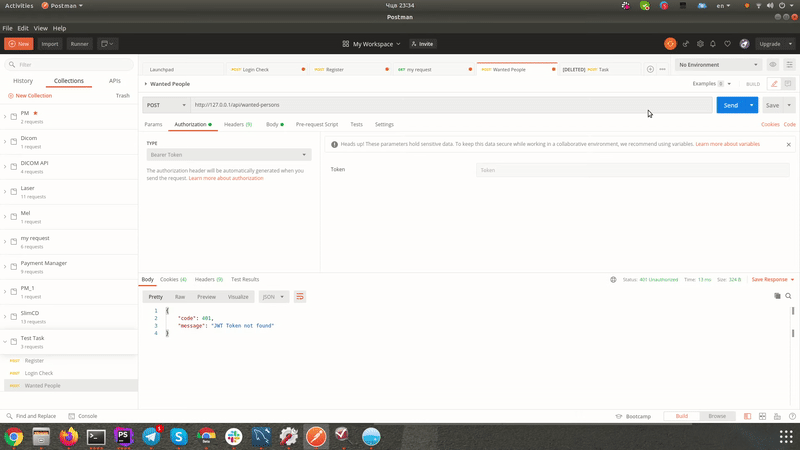
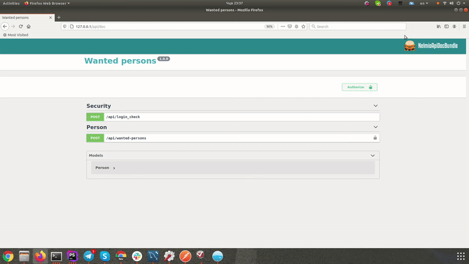

## Project setup 

### Create .env file

Create .env based on the .env.dist.

Generate SSH keys by running these commands (Remember the passphrase you use for keys generation and past it to your .env file to the `JWT_PASSPHRASE` variable):

```bash
mkdir -p config/jwt
openssl genpkey -out config/jwt/private.pem -aes256 -algorithm rsa -pkeyopt rsa_keygen_bits:4096
openssl pkey -in config/jwt/private.pem -out config/jwt/public.pem -pubout
```

Add a value for `NGINX_PUBLIC_PORT` variable for the next step.

### Start containers
```bash
docker-compose up -d --build
```

### Install dependencies
```bash
docker-compose exec php composer install
```

### Create database (or import Wanted_persons.sql)
```bash
docker-compose exec php bin/console doctrine:migrations:migrate
```

### Load fixtures
```bash
docker-compose exec php bin/console doctrine:fixtures:load --env=dev
```

## Api usage

1. Go to `/api/doc` url to see the full list of available actions.
3. Get JWT token for the user on the `/api/login_check` endpoint with `username` and `password`.
4. Pass the token to the Authorize section in "Bearer ***your token***" format.
5. Use any endpoint

### How to use API with Postman


### How to use API with UI (http://127.0.0.1/api/doc)
